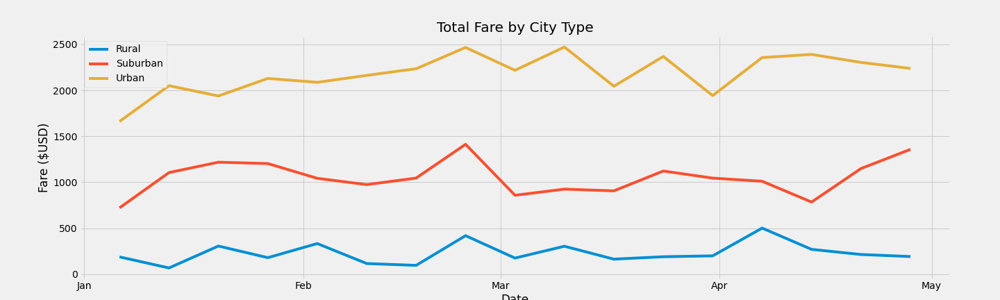

# PyBer_Analysis
## Overview
The purpose of this data analysis is to explore the trends between city type (Urban, Suburban, and Rural), number of drivers, and fares for ride-sharing application PyBer on a weekly basis beginning January 2019 through April 2019. 

## Results
The analysis identified trends including:
- Urban cities report a larger number of total drivers for PyBer and a larger number or total rides, but a lower average fare based on data for all of 2019. Rural cities report a smaller number of total drivers and a smaller number of total rides, but a higher average fare.

- This dataframe illustrates that while there is a difference in average fare per ride between city types, the more significant differences can be found in total rides, total drivers, and average fare per ride. Rural and Suburban cities also experienced more total rides than there are total drivers, while urban cities reported more drivers than total rides (suggesting many drivers were inactive). 
- The larger average fare per ride likely contributes to rural and suburban drivers being more likely to accept a ride request - $34 (avg. fare per ride in rural cities) is more of an incentive than $24 (avg. fare per ride in urban cities). 
- The average fare per driver in urban areas may be dilluted due to the number of drivers being greater than the number of total rides - if drivers were truly inactive, they should not be calculated. If they were active and did not receive ride requests, this average fare per ride ($16.57) should continue to be monitored as it reflects drivers perceived income.

- The new analysis focused specifically on the first quarter of 2019, again comparing total drivers and fares between the three city types. Data was extracted and grouped using both city type and date of fare - by indexing the date, values populate beneath the city type column labels to capture the weekly total of fares collected.

This dataframe allowed to visually display a multiline chart to illustrate the weekly trends for fares in all three city types over the first quarter of 2019.

- As displayed above, urban city types experienced higher weekly totals of fares consistently. All three city types experienced a similar peak in late February but otherwise fluctuated in weeks of higher fares or lower fares. Rural cities were well below suburban and urban cities in weekly totals, even their greatest earning week was less than suburban cities' lowest earning week. Similarly, suburban cities were well below urban cities in weekly totals, even their greatest earning week was less than urban cities' lowest earning week.

## Summary
- The lower fares in urban settings could be related to trip distance (urban areas tend to be clustered while rural areas tend to be more spread out). Urban areas also experience more traffic, so time for each ride may be more of a factor than distance (for both the riders and the drivers). In urban areas, time of day would be an area to explore further to determine if there are trends for both riders and drivers. 
- Lower fares may also be related to supply and demand - urban areas are more likely to have a greater number of ride requests due to the presence of more people, but will also have more options including typically more frequent/reliable public transportation. Rural areas will have fewer options, so riders may be more inclined to pay a higher average fare. Given the lower number of total rides and drivers in rural areas, supply and demand would be an opportunity to explore further - how frequently drivers were available and received no requests but also how frequently riders requested rides that were not available (or had to wait).
- Despite the higher average fare per ride, rural cities experience significantly fewer total rides when compared to suburban or urban cities. While it may be tempting to increase rides that bring in that higher fare, it would be dependent upon their being a large un-met need for hundreds more rides. Rather, in urban areas a slight increase in average fare per ride would have a much more significant impact given the number of total rides - and this would require less effort to recruit drivers and riders in rural settings. 
